# 🩺 Système de Surveillance des Données de Pression Artérielle

## Analyse en Temps Réel avec Kafka, Elasticsearch et Kibana

---

## 1. Contexte et Présentation

La surveillance des patients à partir de leurs mesures de pression artérielle (blood pressure) est cruciale pour détecter les cas nécessitant une attention médicale rapide.

En s'appuyant sur le standard **FHIR** (Fast Healthcare Interoperability Resources), ce projet vise à développer une solution pour analyser ces données, identifier les anomalies, et gérer efficacement les résultats en vue d'un suivi renforcé.

### Objectif Général

Créer un système qui :
- Génère des messages FHIR contenant des données de pression artérielle
- Les transmet via Kafka en temps réel
- Détecte les anomalies nécessitant un suivi médical renforcé
- Traite les données de manière différenciée :
  - **Données anormales** → Indexées dans Elasticsearch et visualisées dans Kibana
  - **Données normales** → Archivées localement

---

## 2. Problématique

> **« Comment identifier et caractériser les patients présentant des anomalies de pression artérielle afin de prioriser les interventions médicales ? »**

### Les défis à relever

- **Volume de données important** : Des milliers de mesures générées quotidiennement par les dispositifs médicaux
- **Détection tardive des anomalies** : Les cas critiques ne sont pas toujours identifiés à temps pour une intervention efficace
- **Difficulté de priorisation** : Comment distinguer les urgences vitales des cas modérés nécessitant un simple suivi ?
- **Manque de visibilité globale** : Absence de vue d'ensemble sur les tendances, patterns et répartitions géographiques

---

## 3. Solution Apportée

### 3.1 Architecture Technique

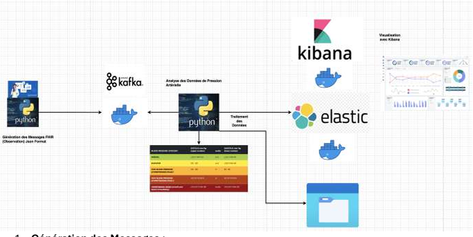

### 3.2 Composants du Système

- **Génération des Messages FHIR (Python)**
  - Utilisation de la bibliothèque Faker pour simuler des patients réalistes
  - Génération d'observations conformes au standard FHIR (ressource Observation)
  - Données incluant : identité patient, âge, genre, localisation GPS, valeurs tensionnelles

- **Transmission avec Apache Kafka**
  - Producer Python : Publication des messages FHIR sur le topic `blood_pressure_topic`
  - Consumer Python : Récupération et analyse des messages en temps réel
  - Architecture distribuée permettant le scaling horizontal

- **Analyse et Détection des Anomalies**
  - Classification selon les seuils de l'American Heart Association (AHA)
  - Attribution d'un niveau de risque : Low, Moderate, High, Critical
  - Routage intelligent : anomalies vers Elasticsearch, données normales vers fichiers locaux

- **Stockage avec Elasticsearch**
  - Indexation des anomalies avec métadonnées enrichies
  - Champs indexés : patient_id, systolic_pressure, diastolic_pressure, category, risk_level, location, timestamp

- **Visualisation avec Kibana**
  - Dashboards interactifs pour le suivi en temps réel
  - Alertes sur les cas critiques
  - Analyses géographiques et temporelles

### 3.3 Classification des Anomalies

Le système utilise les seuils officiels de l'**American Heart Association** :

| Catégorie | Systolique (mmHg) | Diastolique (mmHg) | Niveau de Risque |
|-----------|-------------------|--------------------| -----------------|
| Normal | < 120 | ET < 80 | ✅ Archivé localement |
| Elevated | 120-129 | ET < 80 | 🟡 **Moderate** |
| Hypertension Stage 1 | 130-139 | OU 80-89 | 🟠 **Moderate** |
| Hypertension Stage 2 | ≥ 140 | OU ≥ 90 | 🔴 **High** |
| Hypertensive Crisis | > 180 | ET/OU > 120 | 🚨 **Critical** |
| Hypotension | < 90 | OU < 60 | 🔵 **Low** |

---

## 4. Résultats et Analyse des Dashboards

### 4.1 Statistiques Globales

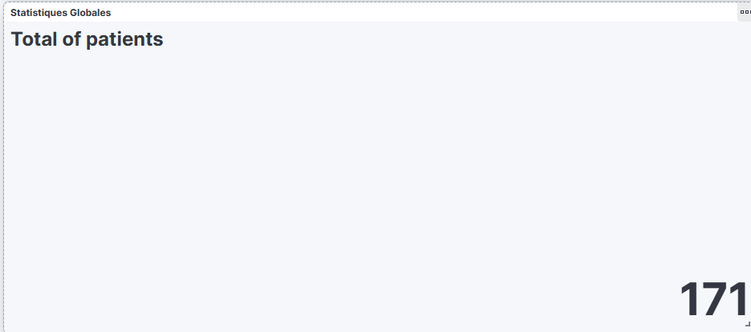

**Observations :**
- **171 patients** analysés durant la session de monitoring
- **Pression systolique moyenne** : 135.94 mmHg → Au-dessus du seuil normal (120 mmHg)
- **Pression diastolique moyenne** : 85.55 mmHg → Légèrement au-dessus de la normale (80 mmHg)

**Interprétation :** Les moyennes globales indiquent une population en zone d'hypertension de stade 1, ce qui justifie pleinement la mise en place d'un système de surveillance renforcée.

---

### 4.2 Distribution des Niveaux de Risque

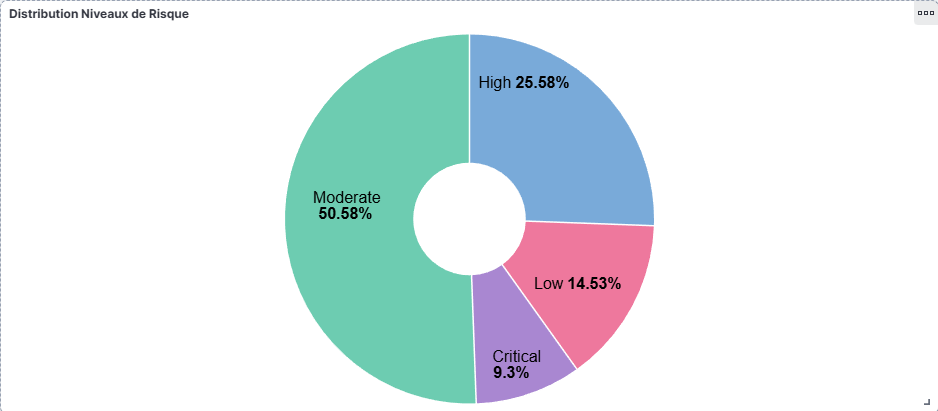

**Répartition observée :**
- **Moderate** : 50.58% → La majorité des anomalies détectées
- **High** : 25.58% → Un quart des patients nécessite un suivi renforcé
- **Low** : 14.53% → Cas d'hypotension à surveiller
- **Critical** : 9.3% → Urgences médicales requérant une intervention immédiate

**Réponse à la problématique :** Le système permet d'identifier instantanément que **près de 35% des patients** (High + Critical) nécessitent une prise en charge prioritaire.

---

### 4.3 Répartition par Catégorie Médicale

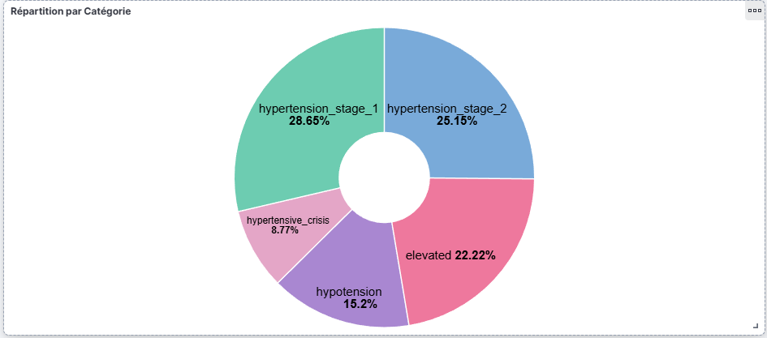

**Analyse détaillée :**
- **Hypertension Stage 1** : 28.65% → Surveillance régulière et modifications du mode de vie recommandées
- **Hypertension Stage 2** : 25.15% → Traitement médicamenteux généralement indiqué
- **Elevated** : 22.22% → Risque d'évolution vers l'hypertension sans intervention
- **Hypotension** : 15.2% → Attention aux risques de malaise et chutes
- **Hypertensive Crisis** : 8.77% → **URGENCE ABSOLUE** nécessitant une prise en charge immédiate

**Point critique :** Les crises hypertensives représentent près de 9% des cas, soit des situations potentiellement mortelles que le système détecte instantanément.

---

### 4.4 Détail des Patients Critiques

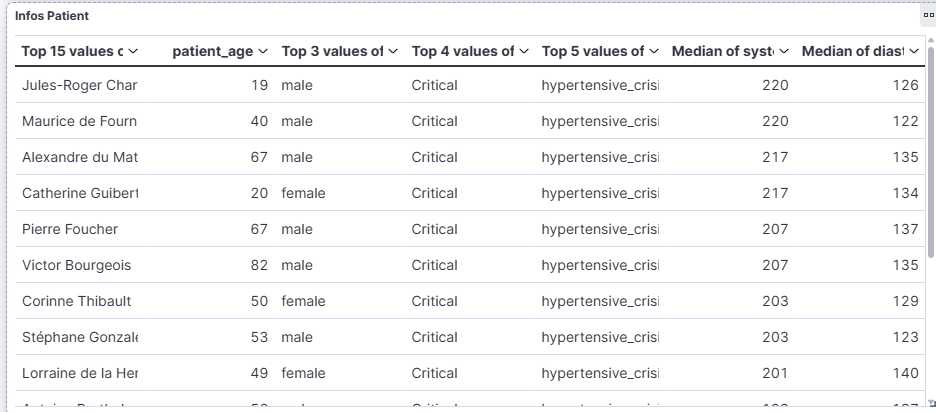

**Patients les plus à risque identifiés :**

| Patient | Âge | Genre | Systolique | Diastolique |
|---------|-----|-------|------------|-------------|
| Jules-Roger Char | 19 ans | Homme | 220 mmHg | 126 mmHg |
| Maurice de Fourn | 40 ans | Homme | 220 mmHg | 122 mmHg |
| Alexandre du Mat | 67 ans | Homme | 217 mmHg | 135 mmHg |
| Catherine Guibert | 20 ans | Femme | 217 mmHg | 134 mmHg |

**Observation importante :** Des patients jeunes (19-20 ans) présentent des valeurs extrêmement élevées, ce qui est particulièrement alarmant et nécessite une investigation approfondie pour écarter des causes secondaires.

---

### 4.5 Analyse Géographique

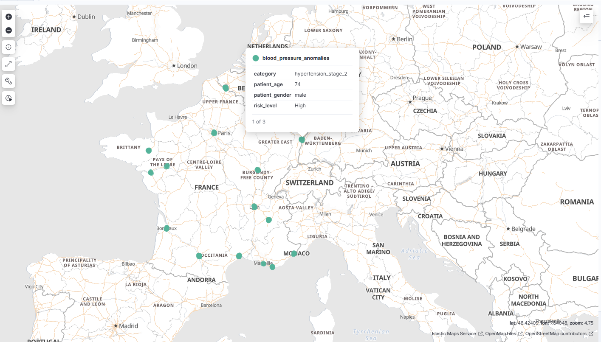


**Distribution par ville française :**
- **Bordeaux** : Plus forte concentration d'anomalies toutes catégories confondues
- **Nice et Toulon** : Pics d'hypertension de stade 2
- **Paris** : Distribution équilibrée entre les différentes catégories
- **Grenoble, Lyon** : Prévalence d'hypertension de stade 1

**Carte interactive Kibana :** La visualisation cartographique permet de localiser précisément chaque patient avec ses données (catégorie, âge, genre, niveau de risque) en cliquant sur les points. Cette fonctionnalité facilite l'identification de clusters géographiques et la coordination des interventions médicales par zone.

---

### 4.6 Corrélation Âge et Risque

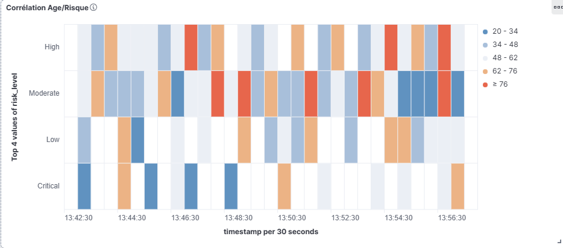

**Analyse par tranche d'âge :**
- **20-34 ans** : Présence surprenante dans toutes les catégories de risque, y compris Critical
- **48-62 ans** : Concentration marquée en risque Moderate et High
- **62-76 ans** : Prédominance des cas High
- **≥ 76 ans** : Risque Critical plus fréquent, nécessitant une surveillance accrue

**Tendance observée :** Le risque cardiovasculaire augmente avec l'âge, mais des anomalies critiques touchent également les jeunes adultes, soulignant l'importance d'un dépistage précoce.

---

### 4.7 Répartition par Genre

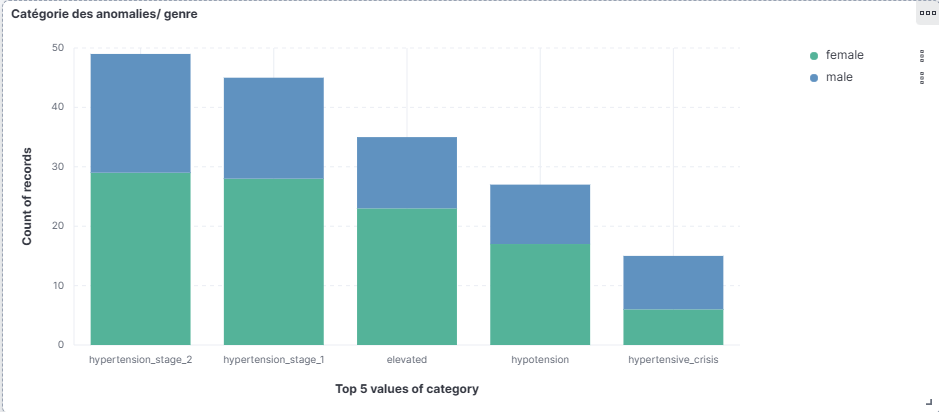

**Comparaison Hommes/Femmes :**
- **Hypertension Stage 2** : Légère prédominance masculine (≈60%)
- **Hypertensive Crisis** : Les hommes représentent environ 60% des cas critiques
- **Hypotension** : Distribution plus équilibrée entre les genres
- **Elevated** : Répartition similaire hommes/femmes

**Insight épidémiologique :** Les hommes semblent plus touchés par les formes sévères d'hypertension, ce qui correspond aux données de la littérature médicale sur les facteurs de risque cardiovasculaire.

---

### 4.8 Évolution Temporelle

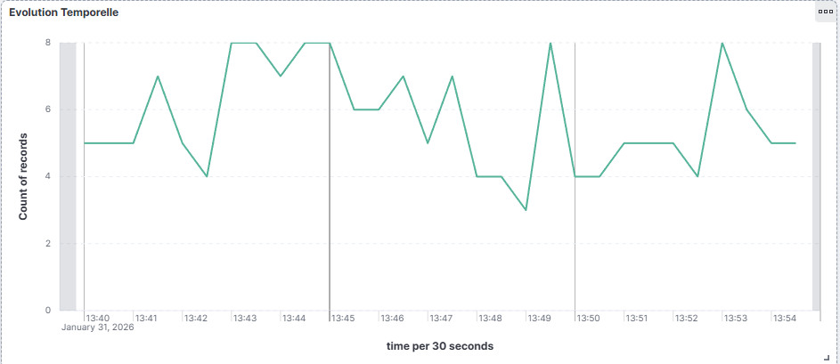

**Tendances observées :**
- Flux constant de **4 à 8 anomalies** par intervalle de 30 secondes
- Pics ponctuels identifiables nécessitant une attention particulière
- Stabilité globale du système de détection démontrant sa fiabilité

**Performance du système :** Le traitement en temps réel avec une latence minimale permet une réactivité optimale face aux situations d'urgence.

---

### 4.9 Distribution par Âge

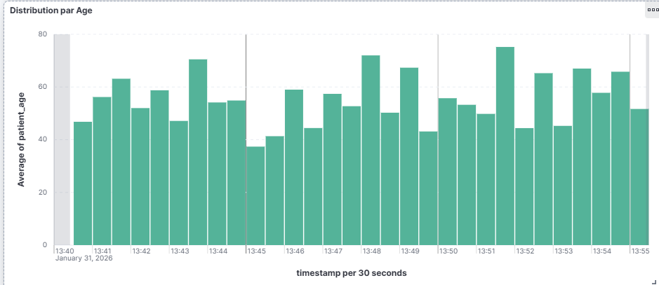

**Profil démographique :**
- Âge moyen des patients variant entre **37 et 75 ans** selon les intervalles
- Moyenne générale autour de **50-55 ans**
- Couverture de toutes les tranches d'âge adultes

**Conclusion :** Le système assure une surveillance adaptée à tous les profils de patients, des jeunes adultes aux personnes âgées.

---

## 5. Ouverture : Module Machine Learning

### 5.1 Objectif

Passer d'une **détection basée sur des règles statiques** à une **prédiction intelligente** du niveau de risque, permettant d'**anticiper** les complications avant qu'elles ne surviennent.

### 5.2 Implémentation

- **Algorithme utilisé** : Random Forest Classifier avec 100 estimateurs
- **Features d'entrée** : Pression systolique, pression diastolique, âge du patient, genre
- **Target** : Niveau de risque prédit (Low, Moderate, High, Critical)
- **Entraînement** : Sur les données historiques des patients normaux, enrichies de cas critiques injectés

### 5.3 Résultats du Module Prédictif

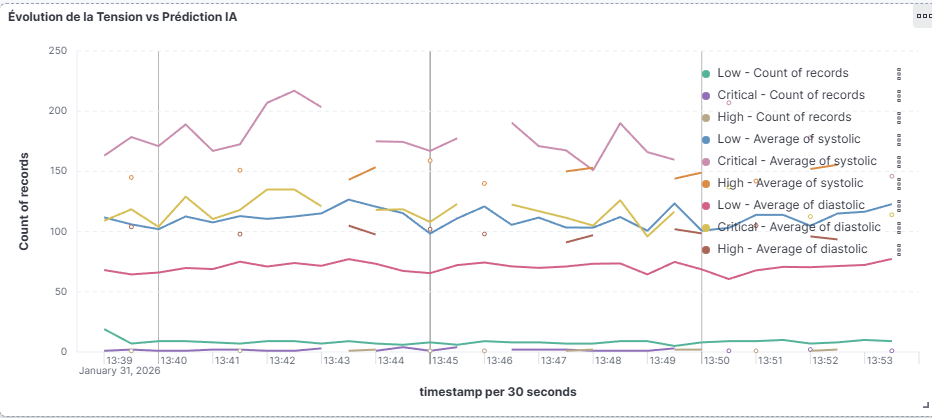

**Comparaison Tension mesurée vs Prédiction IA :**
- Suivi en temps réel des prédictions du modèle
- Corrélation visible entre les valeurs tensionnelles et le risque prédit
- Détection de patterns non linéaires impossibles à capturer avec des règles simples

---

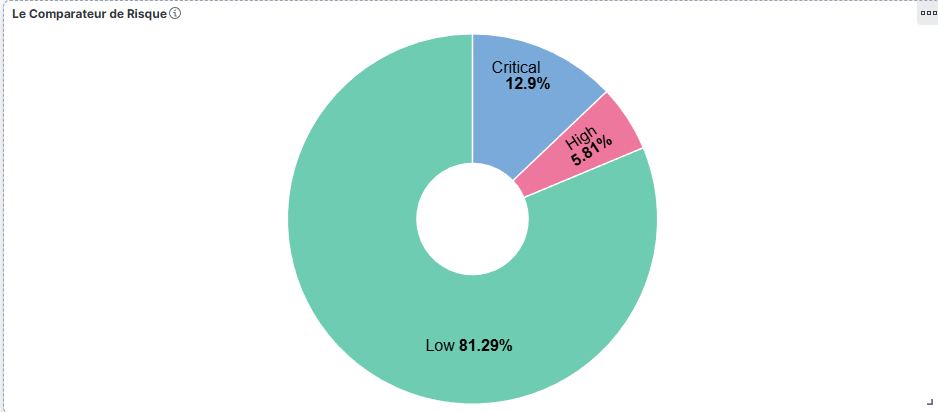

**Distribution des prédictions IA :**
- **Low** : 81.29% → Majorité des cas correctement identifiés comme à faible risque
- **Critical** : 12.9% → Identification efficace des urgences
- **High** : 5.81% → Cas intermédiaires détectés

**Performance :** Le modèle ML offre un outil d'aide à la décision complémentaire pour les cliniciens.

---

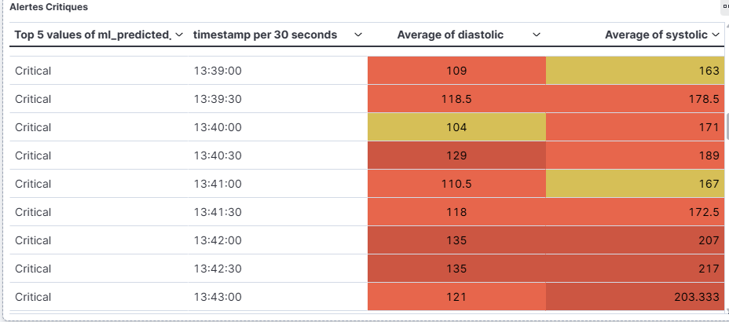

**Alertes générées par l'IA :**
- Tableau des cas critiques prédits avec timestamps
- Moyennes de pression associées à chaque niveau de risque
- Historique temporel permettant d'identifier des tendances

### 5.4 Avantages du Machine Learning

| Critère | Règles Statiques | Machine Learning |
|---------|-----------------|------------------|
| Adaptabilité | ❌ Seuils fixes | ✅ Apprentissage continu |
| Patterns complexes | ❌ Non détectés | ✅ Corrélations multivariées |
| Personnalisation | ❌ Même règle pour tous | ✅ Adaptation au profil patient |
| Approche | ❌ Réactive | ✅ Prédictive et proactive |

### 5.5 Perspectives d'Amélioration

- **Deep Learning** : Réseaux de neurones pour des prédictions plus fines
- **Séries temporelles** : Intégration de l'historique patient avec des modèles LSTM
- **Federated Learning** : Entraînement décentralisé respectant la confidentialité des données
- **Explicabilité** : Ajout de SHAP/LIME pour comprendre les décisions du modèle

---

## 6. Conclusion

### Réponses à la Problématique

✅ **Identification** → Détection en temps réel des patients présentant des anomalies tensionnelles

✅ **Caractérisation** → Classification précise selon 6 catégories médicales conformes aux standards AHA

✅ **Priorisation** → Attribution claire de 4 niveaux de risque permettant de hiérarchiser les interventions

✅ **Visualisation** → Dashboards Kibana interactifs offrant une vue d'ensemble et des alertes ciblées

✅ **Scalabilité** → Architecture Kafka/Elasticsearch capable de traiter des volumes importants

### Valeur Ajoutée pour le Personnel Médical

| Situation Avant | Situation Après |
|-----------------|-----------------|
| Détection manuelle et tardive | Alertes automatiques en temps réel |
| Aucune vue d'ensemble | Dashboards consolidés et interactifs |
| Priorisation subjective | Classification objective par niveau de risque |
| Données dispersées | Centralisation et historisation complète |
| Approche réactive | Approche proactive avec le module IA |

### Impact Attendu

- ⏱️ **Réduction significative du temps de détection** des situations d'urgence
- 🎯 **Meilleure allocation des ressources médicales** vers les cas prioritaires
- 📈 **Suivi longitudinal** des tendances par patient et par population
- 🔮 **Anticipation des complications** grâce au module de prédiction IA

---

## 7. Installation et Lancement

### 7.1 Prérequis

- Docker et Docker Compose
- Python 3.10+
- pip

### 7.2 Installation

```bash
# Cloner le repository
git clone https://github.com/votre-username/blood-pressure-monitoring.git
cd blood-pressure-monitoring

# Installer les dépendances Python
pip install -r requirements.txt

# Lancer l'infrastructure Docker
docker-compose up -d
```

### 7.3 Lancement du Système

```bash
# Terminal 1 : Lancer le Consumer
python consumer.py

# Terminal 2 : Lancer le Producer
python producer.py

# Terminal 3 (optionnel) : Lancer le Consumer ML
python consumer_ml.py
```

### 7.4 Accès aux Interfaces

- **Kibana** : http://localhost:5601
- **Elasticsearch** : http://localhost:9200

---

## 8. Dépannage

### Problème : Container already in use

Si tu vois cette erreur :
```
Error response from daemon: Conflict. The container name "/elasticsearch" is already in use
```

**Solution :** Supprimer les anciens containers et relancer :

```bash
# Arrêter tous les containers du projet
docker stop zookeeper elasticsearch kafka kibana

# Supprimer les containers
docker rm zookeeper elasticsearch kafka kibana

# Relancer
docker-compose up -d
```

### Problème : Erreur d'installation pip

Si tu vois une erreur avec `scikit-learn` ou `Microsoft Visual C++` :

**Solution :** Installer sans versions fixes :

```bash
pip install confluent-kafka elasticsearch faker scikit-learn pandas joblib
```

### Problème : Kafka ne démarre pas

**Solution :** Attendre 30 secondes que Zookeeper démarre, puis :

```bash
docker-compose restart kafka
```

### Problème : Consumer ne reçoit pas de messages

**Solution :** Changer le `group.id` dans `consumer.py` (incrémenter le numéro) :

```python
KAFKA_GROUP_ID = 'health-monitor-final-v10'  # Changer v9 en v10
```

---

## 9. Structure du Projet

```
blood-pressure-monitoring/
├── docker-compose.yml       # Infrastructure Docker (Kafka, ES, Kibana)
├── requirements.txt         # Dépendances Python
├── fhir_generator.py        # Génération des messages FHIR
├── producer.py              # Producteur Kafka
├── consumer.py              # Consommateur + indexation ES
├── train_ml.py              # Entraînement du modèle ML
├── consumer_ml.py           # Consumer avec prédictions temps réel
├── blood_pressure_model.pkl # Modèle ML sauvegardé
├── normal_data/             # Archivage des données normales
│   └── patients_sains.json
└── screenshots/             # Captures des dashboards
```

---

## 10. Technologies Utilisées

| Technologie | Version | Rôle |
|-------------|---------|------|
| Python | 3.10+ | Langage principal |
| Apache Kafka | 7.5.0 | Streaming de données |
| Elasticsearch | 8.11.0 | Indexation et recherche |
| Kibana | 8.11.0 | Visualisation |
| Scikit-learn | 1.3.2 | Machine Learning |
| Faker | 22.0.0 | Génération de données |
| Docker Compose | 3.8 | Orchestration |

---

## 11. Références

- [Standard FHIR - HL7](https://www.hl7.org/fhir/overview.html)
- [American Heart Association - Blood Pressure Categories](https://www.heart.org/en/health-topics/high-blood-pressure)
- [Apache Kafka Documentation](https://kafka.apache.org/documentation/)
- [Elasticsearch Reference](https://www.elastic.co/guide/en/elasticsearch/reference/current/index.html)

---

## 📝 Auteurs

Projet réalisé par Eya DKHILI et Lysa HALLI
